<div style="text-align:center"><h1>Nachos Dev Environment</h1></div>

- [前言](#前言)
- [事前準備](#事前準備)
  - [(For Windows User) WSL install](#for-windows-user-wsl-install)
  - [WSL or Linux (Ubuntu 18.04 LTS)](#wsl-or-linux-ubuntu-1804-lts)
    - [Windows WSL用戶](#windows-wsl用戶)
    - [進入WSL或是在Linux中](#進入wsl或是在linux中)
- [如何起步](#如何起步)
  - [Cross-compiler](#cross-compiler)
  - [Build Nachos](#build-nachos)
  - [Build Test](#build-test)
  - [Development skills](#development-skills)
    - [Debug Flag](#debug-flag)
    - [GDB (GNU Debugger)](#gdb-gnu-debugger)
- [初探作業系統](#初探作業系統)

# 前言
本開發環境基於 NTUST - Nachos4.0 , 並參考 UC Berkeley 的 Nachos 4.1 Core 進行修改, 針對幾點進行改善：
- 提供shell script, 降低各開發者針對環境初始化的不同設定衝突
- 透過 GNU Compiler flag 以及 g++ multilib 支援 64 bits 編譯 32 bits的Nachos
- 和 Visual Studio Code 進行整合
- 透過 VSC 擴充, 加強 c++ 的語法提示以及型別整合
- 修改部份 nachos 核心, 使得 c++11 執行可能
- 提供VSC 與 GDB的整合, 可以在 GUI 上運行 gdb 來除錯
- 程式碼耦合性減低

透過大量的事前準備, 可以使得開發人員更專注在作業系統編寫, 演算法的優化上, 而不是在開發環境上耗盡心思
因為有修改部份核心, 所以不適用在原本NTUST的 Nachos4.0 上, 但是有使用過 docker 模擬過, 可以在 VScode 上執行原本的程式碼
但是需要進行幾點工作：
- Ubuntu 64bits (建議 Ubuntu 16.04以上), 因為 VSCode 需要在 64bits 客體上運行
- 修改 install.sh: compiler block (把 sudo apt-get install -y g++-multilib g++-multilib 註解)
- 啟用 install.sh 的 support i386 block
- 啟用 install.sh 的 docker block
docker 的運作指令, 寫入在 `package.json` 中供大家參考

<div style="text-aligen:center">

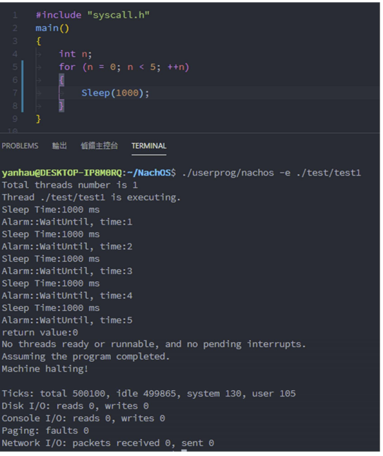
</div>
如圖所示, 一樣可以使用 VScode 在助教提供的 Nachos4.0 edition 上編寫程式碼, 以下提供測試表格參考

| | Ubuntu 14.04 | Ubuntu 16.04 | Ubuntu 18.04 | Ubuntu 20.04 |
| - | - | - | - | - |
| Nachos4.0(助教版) C++11 support | No | Maybe | Maybe | Maybe |
| Nachos4.0(助教版) VSCode support | No (32bit 不可執行 64bit 的VSC ) | Yes | Yes | Yes |
| Nachos4.0(助教版) VSCode GDB GUI support | No (32bit 不可執行 64bit 的VSC ) | Maybe | Maybe | Maybe |
| Nachos4.0(助教版) Docker support | 不需要 | Unknown | Yes | Yes |
| Nachos4.0(助教版) Origin Compile 32-bit support | 不需要 | Yes | Yes | Yes |

* Maybe 表示未測試, 但是應該可行, 需要進行部份程式碼修改

| | Ubuntu 14.04 | Ubuntu 16.04 | Ubuntu 18.04 | Ubuntu 20.04 |
| - | - | - | - | - |
| Nachos4.1(yhc版) C++11 support | No | Yes | Yes | Yes |
| Nachos4.1(yhc版) VSCode support | No (32bit 不可執行 64bit 的VSC ) | Yes | Yes | Yes |
| Nachos4.1(yhc版) VSCode GDB GUI support | No (32bit 不可執行 64bit 的VSC ) | Yes | Yes | Yes |
| Nachos4.1(yhc版) Docker support | 不需要 | Yes | Yes | Yes |
| Nachos4.1(yhc版) Origin Compile 32-bit support | 不需要 | Yes | Yes | Yes |

<div style="font-weight:900">
<br/><br/>
特別注意： 該版本和上課提供的版本的核心運作不全然相同 , 也不包含一開始的 Sleep Example, 所以才提供與 IDE 的深度整合, 讓開發者更好理解程式碼運作的機制. 如果自行處理好環境, 建議可以看看 <a href="#初探作業系統">這裡</a>, 對作業系統簡單了解
</div>

# 事前準備
## (For Windows User) WSL install
請以 **管理員身分** 開啟 windows power shell, 輸入以下指令
```shell
$ systeminfo | find "System Type"
$ dism.exe /online /enable-feature /featurename:Microsoft-Windows-Subsystem-Linux /all /norestart
$ dism.exe /online /enable-feature /featurename:VirtualMachinePlatform /all /norestart
```
並且根據系統型別(x64 or arm64), 下載對應的 WSL更新檔

[x64](https://wslstorestorage.blob.core.windows.net/wslblob/wsl_update_x64.msihttps://wslstorestorage.blob.core.windows.net/wslblob/wsl_update_x64.msi)

[arm64](https://wslstorestorage.blob.core.windows.net/wslblob/wsl_update_arm64.msi)

完成後, 在 Power Shell中執行
```shell
$ wsl --set-default-version 2
```
最後, [下載WSL](https://www.microsoft.com/zh-tw/p/ubuntu-1804-lts/9n9tngvndl3q?rtc=1&activetab=pivot:overviewtab)  或是在Windows商店輸入 Ubuntu 18.04 LTS 查詢) 並啟動

下載過程, 可以先在 Visual Studio Code 安裝 Remote WSL 套件, 之後等到WSL下載完成並啟動後, 設定帳號、密碼

## WSL or Linux (Ubuntu 18.04 LTS)

### Windows WSL用戶
可以在 `"開始" -> "Ubuntu"` 開啟 WSL, 或是在 VSCode 的 `RemoteWSL` 套件中開啟(建議)。
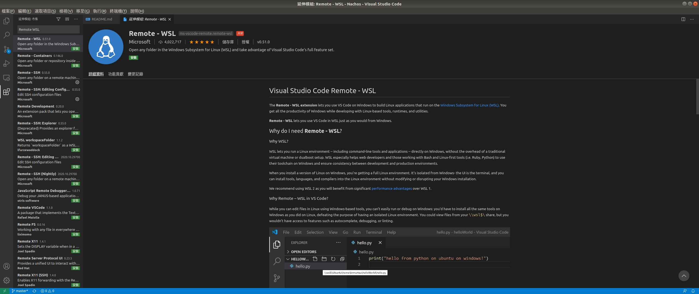
請注意, 請進入到 WSL的家目錄( ~/ 或是 /home/[username]) 下, 不要到 windows的目錄( /mnt/* )
因為 windows 目錄對 Virtual Machine 是掛載點 , 會受到一些作業系統的限制


### 進入WSL或是在Linux中
若為設定 git 資訊, 請先設定 git 資訊, 然後才 clone 專案
```shell=
$ git config --global user.name <Your username>
$ git config --global user.email <Your email>
```

把專案 clone 下來後, 在專案根目錄下執行
```shell=
$ chmod +x ./install.sh
$ ./install.sh
```
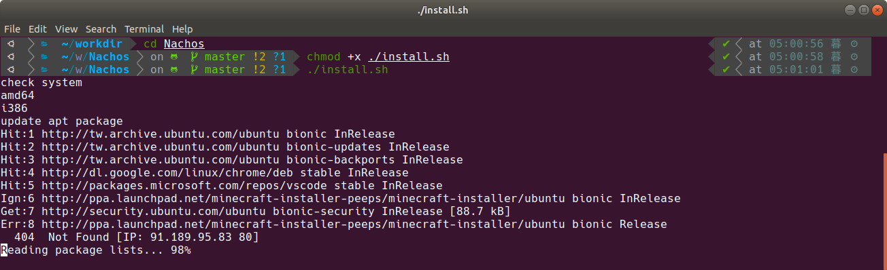
完成後, 已經完成套件安裝. install.sh中, 包含 docker 與 npm 的下載指令, 若有需要可以使用。

在 64 bits System 上, 已經完成對 32 bit System compiler的支援 , 透過使用 `g++-multilib gcc-multilib` 兩個 library , Ubuntu 16.04 ~ 20.04 的開發者, 已經完成向下編譯的支援

若想直接使用舊版 gcc 編譯, 可以取消 install.sh 中 `support i386` 區塊的註解, 並且自行安裝舊版 g++ 進行後編譯
若有其他考量 , 也可以使用 docker 封裝 i386的 Ubuntu 14.04, 取消 install.sh `docker` 區塊的註解, 然後修改 package.json 的 `<your 'code' path>`, 把自己的 `/code` 資料夾掛載到docker中, 進行編譯即可(專案根目錄已經提供 Dockerfile)

# 如何起步
以下環境, 皆假設在 Linux / WSL 2 中執行

## Cross-compiler
若執行完成 install.sh , coff2noff 資料夾下應該會有檔案 `coff2noff`, 若沒有該檔案, 可以到 `<project root>/conff2noff`執行 ./configure , 並且把 `<project root>/conff2noff/Makefile` CFLAGS, LD 加上 `-m32` 編譯選項 (可直接參考 `./install.sh` 中的 `cross-compiler` 區塊指令)
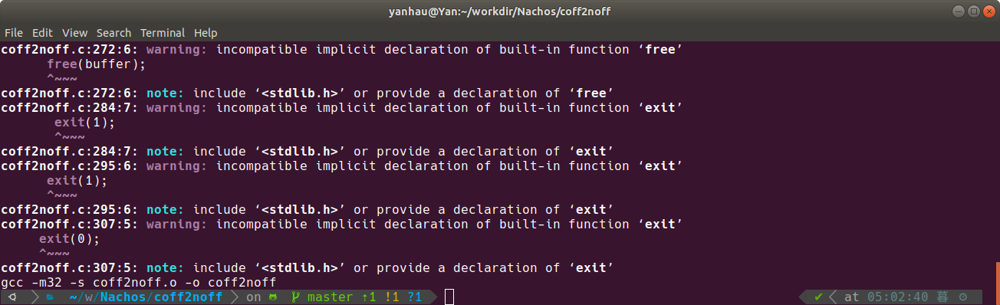
請注意, 最後編譯的選項需要有 `-m32` 參數

## Build Nachos
接下來, 請到 `<project root>/code/build` 中執行 `cp ./depend.example ./Makefile.dep`, 再執行 `make depend`
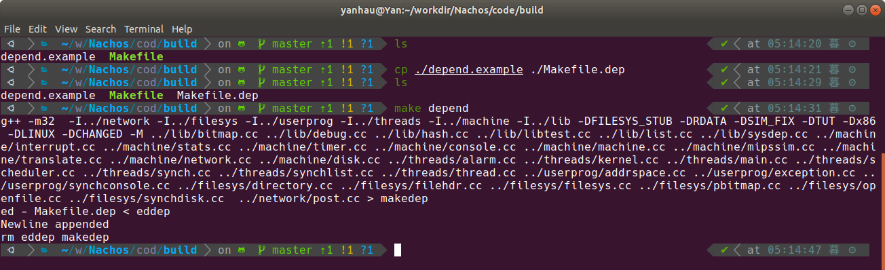
此時會建立好編譯器的 Depends , 最後再執行 `make` , 就會編譯完成 nachos
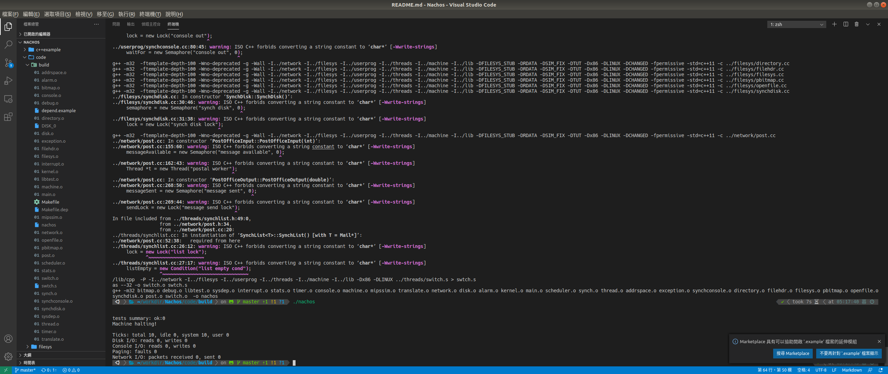
如圖所示, 會建立出 `*.o` 檔案, 最後執行 `./nachos` , 會執行Nachos core, 若無出錯, 就對Nachos 編譯完成

## Build Test
最後, 請到 `<project root>/code/test` 中執行 `make`
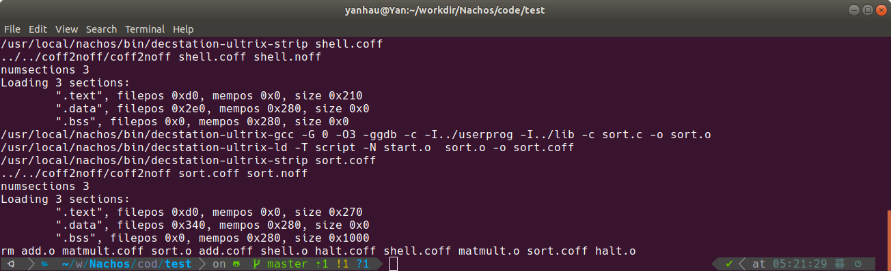
輸出若無異常, 就編譯好 test code.
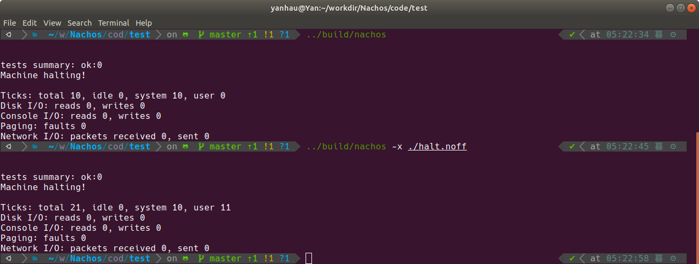
可以使用 `nachos -x <filename.noff>` , 執行編譯好的檔案

## Development skills
接下來, 我們可以開始針對 Nachos 進行修改, 但是在此之前, 有幾項你應該學會的技巧
### Debug Flag
Debug Flag 是一個很實用的技巧, nachos中可以使用 `nachos -d <Flag>`, 開啟對應的Debug Flag, 可以在 `lib/debug.h`查看, 比方說:
- -d + Debug All
- -d t Debug thread
- -d i Debug interrupt
- -d f Debug file system
- -d a Debug address spaces
- -d u Debug system call
透過開啟 DEBUG flag, 可以大幅提高開發效率
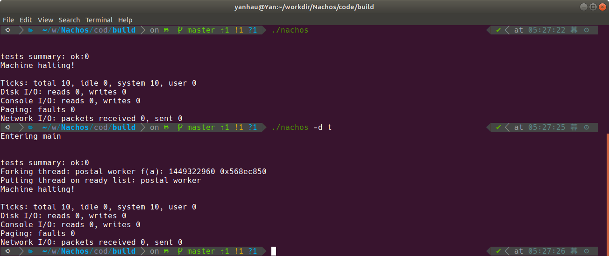
當然, 我們亦可以自行插入 DEBUG Flag, 比方說在某處使用
```cpp
/* Some statment*/
.
.
.
DEBUG('*', "It's MY DEBUG FLAG!");
.
.
.
/* Some statment*/
```
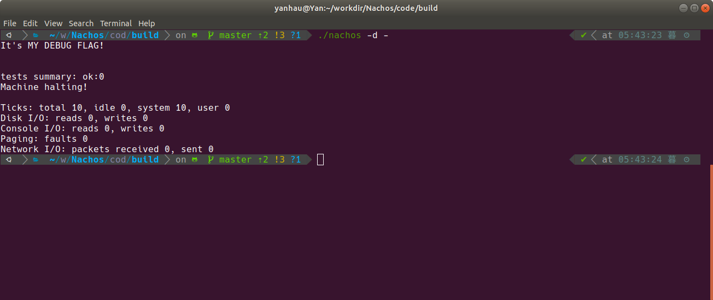
如圖所示, 我們就加入了自己的DEBUG flag

### GDB (GNU Debugger)
本專案之所以要特別 Patch 到 VSCode 上, 實際上是為了更高效率的開發, 而 Debugger Tools 整合, 正是現代化大型工程不可缺少的一環
倘若使用 VSCode , 請先安裝 `C++ Extension`, 並且確認自己有安裝gdb (`apt install gdb`)
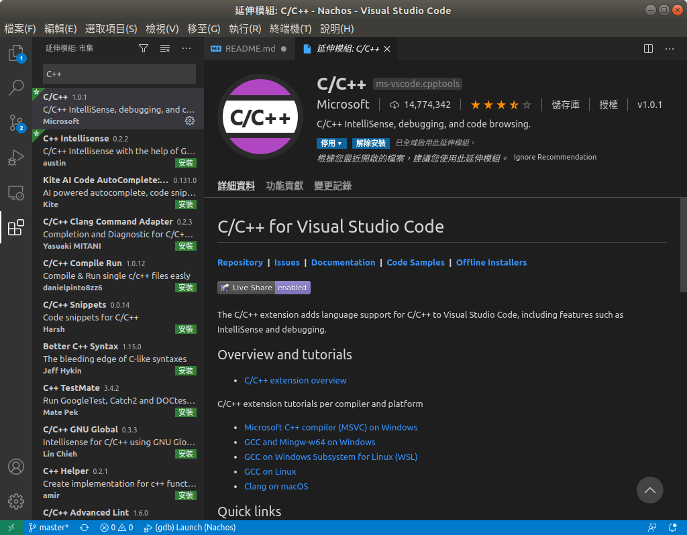
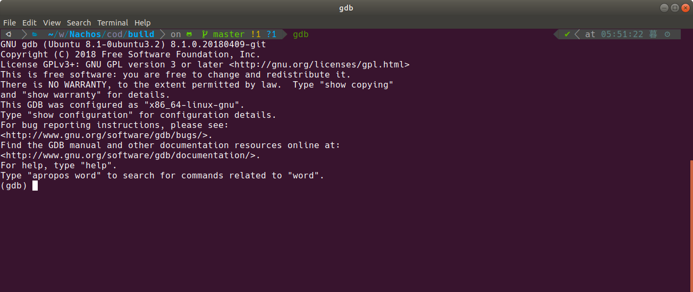
在 `.vscode/launch.json` 中我們已經提供一個樣板給你
```json
{
    "version": "0.2.0",
    "configurations": [
        {
            "name": "(gdb) Launch",
            "type": "cppdbg",
            "request": "launch",
            "program": "${workspaceFolder}/code/build/nachos", ↤ nachos 進入點
            "args": [], ↤ 參數
            "stopAtEntry": false,
            "cwd": "${workspaceFolder}",
            "environment": [],
            "externalConsole": false,
            "MIMode": "gdb",
            "setupCommands": [
                {
                    "description": "enable gdb beautiful display",
                    "text": "-enable-pretty-printing",
                    "ignoreFailures": true
                }
            ]
        }
    ]
}
```
倘若你的程式碼位置和我們不同, 請修改 `program` 的值 , `cwd` 意思是指 ”Current Work Dir”, `workspaceFolder`是 vscode提供的, 相當於工作根目錄, 而我們把 nachos編譯好放在 `<root>/code/build/`下, 因此 `program` 定義為 `${workspaceFolder}/code/build/nachos`, `args` 表示傳給nachos的參數, 比方說可以輸入 `"args": ["-d", "t"]` , 執行後相當於跑了 `nachos -d t`, 所以如果要測試 system call , 可以輸入 `"args": ["-x", "code.noff"]` ...等


# 初探作業系統
首先, 我們先有個共識：在 Linux 中, OS會先初始化 `init` 這個process, 並且之後執行的程式會Fork該行程, 所以我們可以知道作業系統都是由Thread的初始化開始的, 在此前提下, 我們使用GDB, 簡易的導讀作業系統的運作
因此我們先修改 `launch.json`
``` json
{
    "version": "0.2.0",
    "configurations": [
        {
            "name": "(gdb) Launch",
            "type": "cppdbg",
            "request": "launch",
            "program": "${workspaceFolder}/code/build/nachos",
            "args": ["-x", "${workspaceFolder}/code/test/halt.noff"],
            "stopAtEntry": false,
            "cwd": "${workspaceFolder}",
            "environment": [],
            "externalConsole": false,
            "MIMode": "gdb",
            "setupCommands": [
                {
                    "description": "enable gdb beautiful display",
                    "text": "-enable-pretty-printing",
                    "ignoreFailures": true
                }
            ]
        }
    ]
}
```
因為我們知道, 作業系統需要初始化, 因此我們載入 Test Example: `halt.noff`, 來觀察 Kernal 與 User State的切換, 按下 F5 進入Debugger:

進入 Nachos的 main function
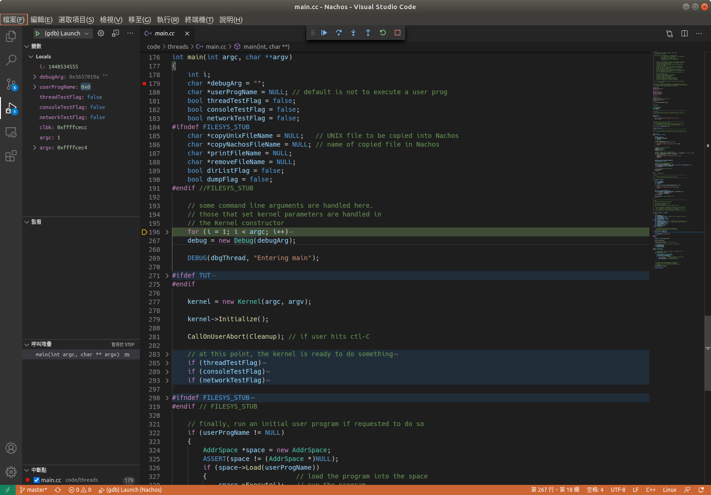

此時, 可以 Nachos 在檢測一些執行時的flag , args(如 -x filename, -d flag 等)
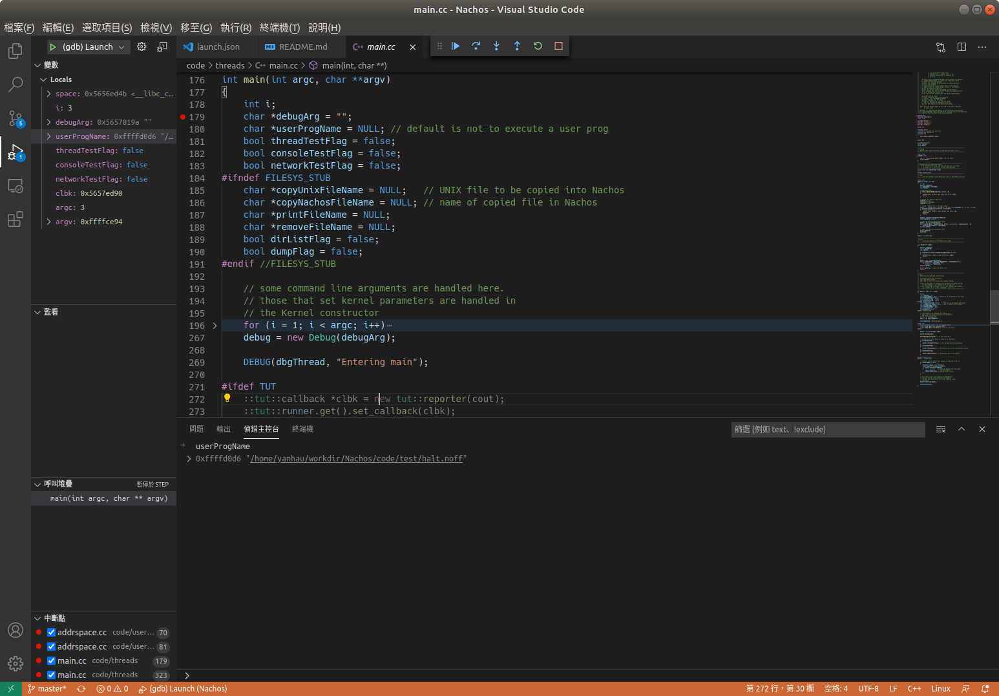

如一開始說明的,可以看到 kernel initial 所做的事情來知道, 必須先創造 Main Thread
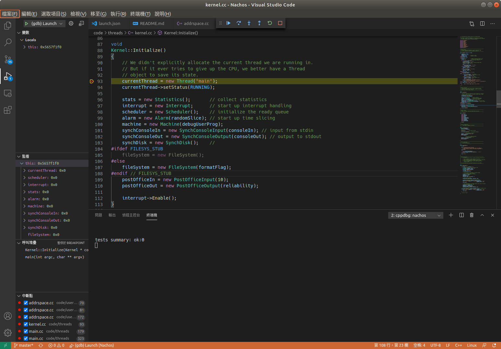

不斷運行, 直到準備進入 userProg 的區塊. 此時可能會發現, 左邊的變數會出現一些指標不好觀察, 可以在下方的"偵錯主控台"直接輸入GDB的指令, 如 p /s userProgName 把 "userProgName" 以字串方式印出來(如下方所示), 這時會看到目前的userProgName是 /test/halt.noff
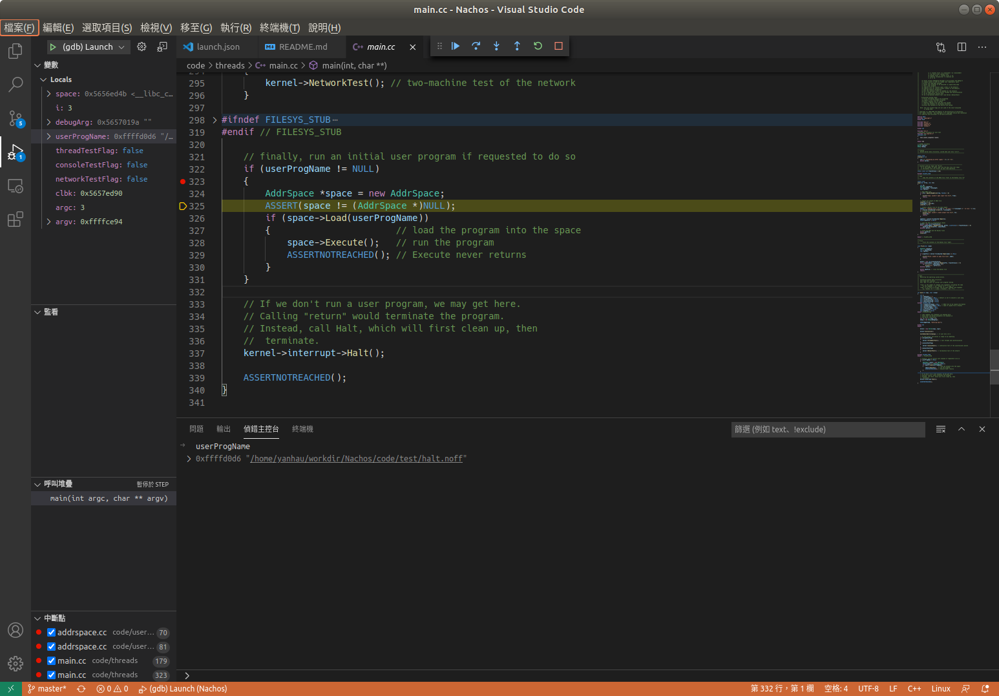

此時, 我們已經準備好OS了, 可以看到Nachos在準備 Address space(定址空間), 也就是某個特定的行程, 在記憶體中可以使用與控制的位址區段, 並且要初始化 Main Memory
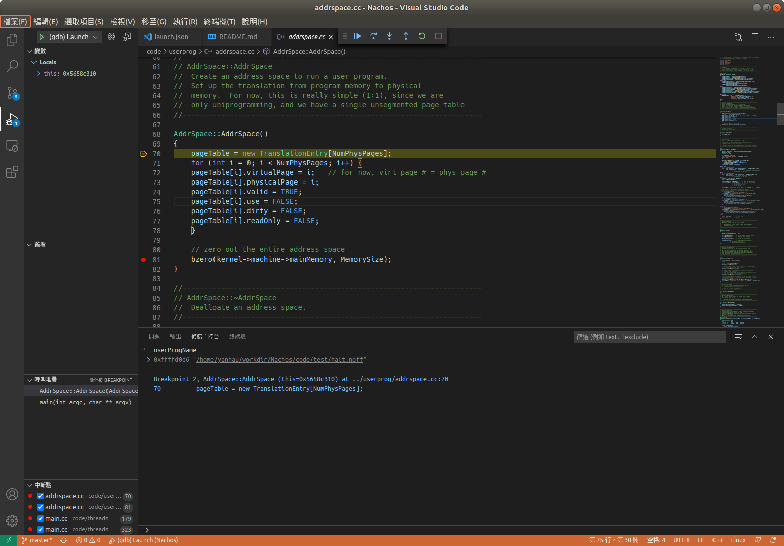

下一步, 是載入UserProg, 會看到是由 kernel的 File System來處理, 接下來就準備執行
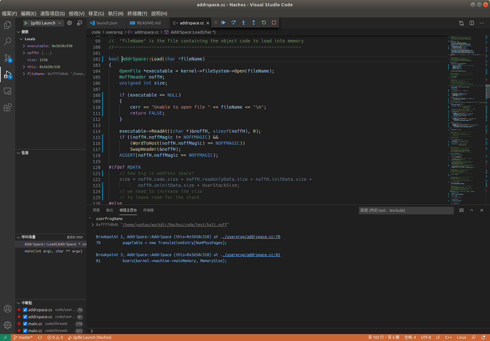

執行開始, 會開始讀寫Register上的資訊, 然後等一下就會進到 machine->Run
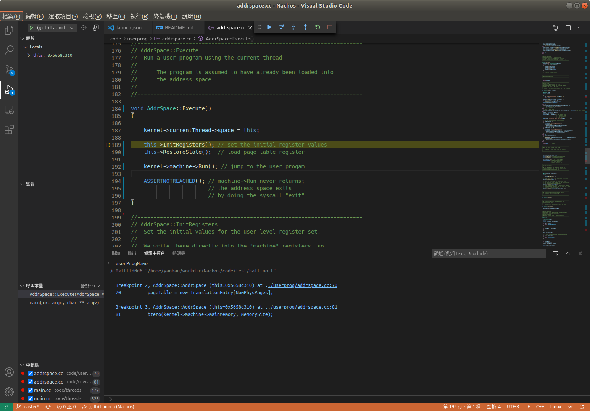

此時已經開始進行 System Call 了, instr就是指令解碼器, 這裡的重點其實是 66 Line 的 for(;;), 一個無窮迴圈, 裡面不斷執行OneInstruction() 以及 OneTick()  ！P.S. 請注意右下方的Function Call Stack, 可以知道程式的工作狀態
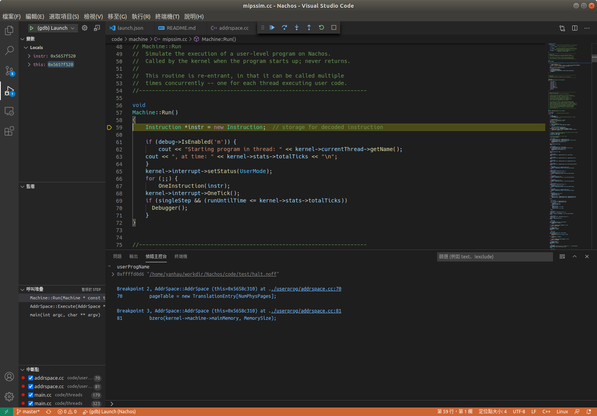

OneInstruction 就是不斷擷取指令, 然後讀取下一個PCReg
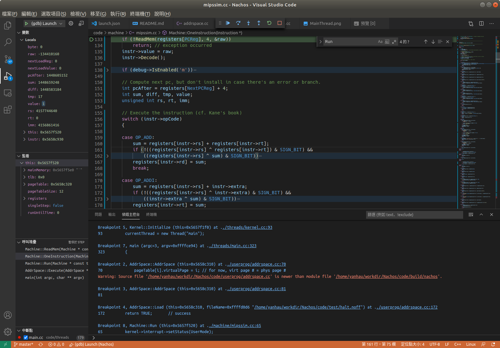

OP_CODE 節錄
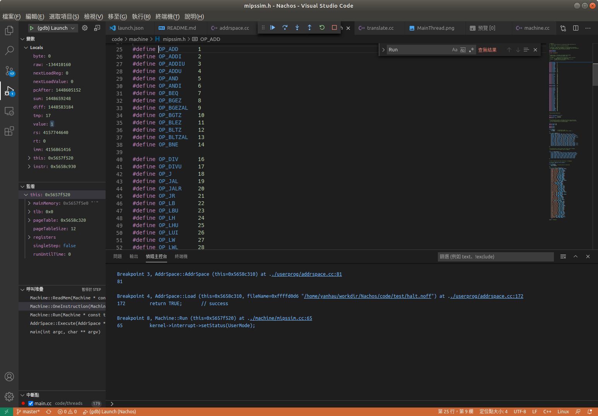

OneTick 類似於 CPU 的時脈, 諸如中斷處理, User Tick, Kernel Tick的計算等 , 並且不斷對Thread排程 ( 重點是currentThread->Yield() )
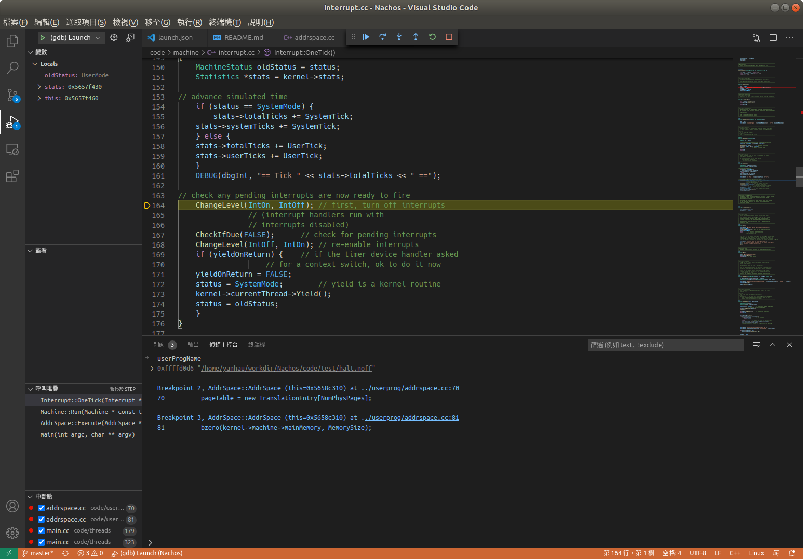

而一般的作業系統, 開機後就會不斷運行, 但是Nachos只是模擬而已, 因此會有一個時間的限制, 倘若沒有UserProg, 或是沒有Halt(), 會在某個時間後停止運作, 並且擲出錯誤
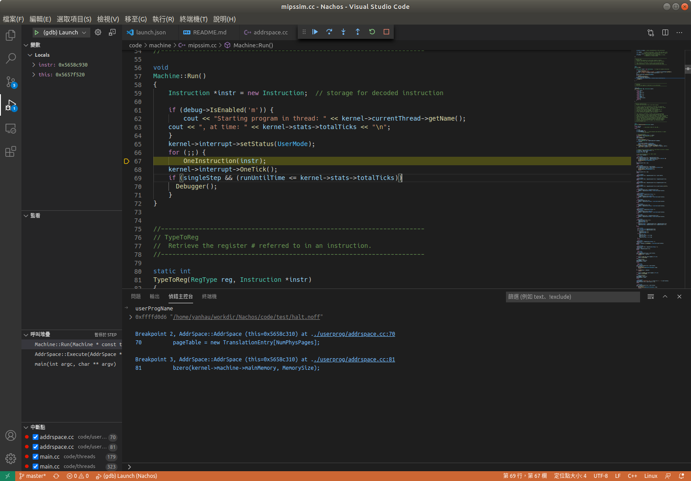

結合 GDB 與 Nachos 的 DEBUG tools, 可以深度追蹤作業系統的運ㄑ作, Nachos可以觀察每個Tick的運作狀況, GDB可以觀察整體程式碼的運作過程
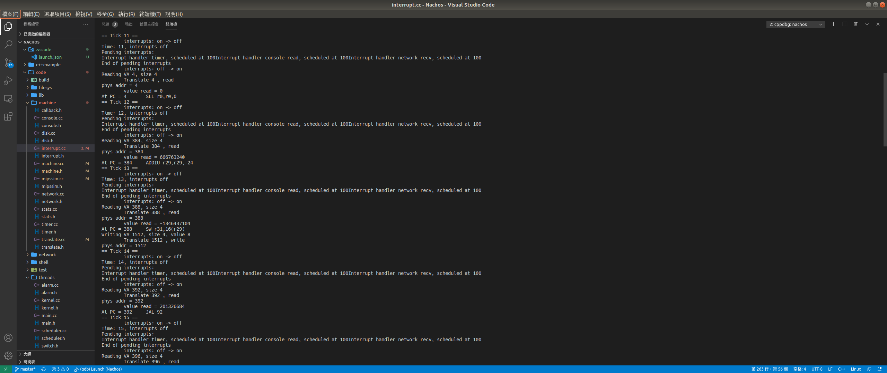


於此, 已經把執行一次userProg的流程看過了, 就可以開始看到哪些地方可以修改, 比方說: 一次要執行多個程式, 是不是要在 **addrspace** 管理記憶體分頁, 要處理 Thread排程, 也許在 **thread** 中可以加入 Queue 來進行處理, 若只使用Queue, 就是 FIFO, 若使用 Priority Queue, 就是具有**優先級**的Thread 處理; 透過 IDE tool + C++ Format + GDB + Nachos Debugger, 可以逐步觀察nachos如何模擬一個作業系統